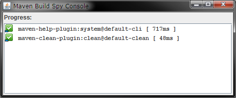

# m2e-phasesandgoals
Fragment for M2E Core UI 
This extends M2E Core UI with commands related to Phases and Goals.

## Show Phases and Goals

Select a Maven project in the IDE and then invoke `Project > Phases and Goals` command. It shows all the phases  and goals  in a checkbox tree dialog.

- You can run the selected goals using the `Launch selected goals`  command.
- Expand All /Collapse All 
- Use the `Log All`  command to print the tree into the Maven Console.
- Selecting Phase selects associated goals
- In `Run goals in selection order mode`, the goals are added to the set in the order in which they were selected. This allows you to run the goals in any order you like.
- The dialog is now modeless. This allows multiple invocation on different projects.
- If there are multiple Maven projects in the workspace, a selector for other project's is shown, thus allowing invoking the Phase and Goals dialog on the selected project.
- If there is only one maven project in the workspace it is always selected.
- Added a simple Maven Build Spy. It shows the success or failure of the goals, the timing and the exception message as a tooltip for failed goals.

You can even use the spy in your Maven builds by:

- Downloading the [Maven Build Spy jar](https://github.com/sandipchitale/m2e-phasesandgoals/blob/master/org.eclipse.m2e.core.ui.phasesandgoals/mavenbuildspy/mavenbuildspy.jar).
- And then passing the following parameter to your mvn build like so:

`> mvn -Dmaven.ext.class.path=path-to/mavenbuildspy.jar ....`
 
### Maven enhancement

Ideally this should be available via standard Maven command-line. For example the

`mvn help:describe -Dcmd=package`

command should be enhanced in terms from listing the actual goals bound to the phases. That way you can list the goals and then invoke them (by including the execution id). And the same mechanism behind the enhancement should/could be used to implement something like:

`mvn test-compile pre-integration-test...post-integration-test`

That way you can only run all the goals associated with

- test-compile
- pre-integration-test
- integration-test (due to ... )
- post-integration-test
