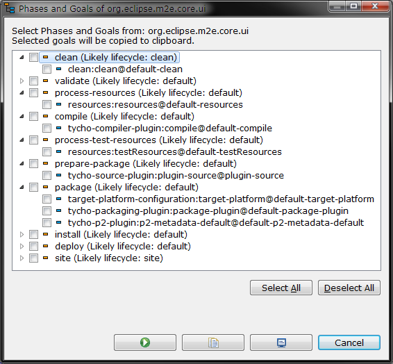

# m2e-phasesandgoals
Fragment for M2E Core UI 
This extends M2E Core UI with commands related to Phases and Goals.

## Show Phases and Goals

Select a Maven project in the IDE and then invoke `Project > Show Phases and Goals` command

